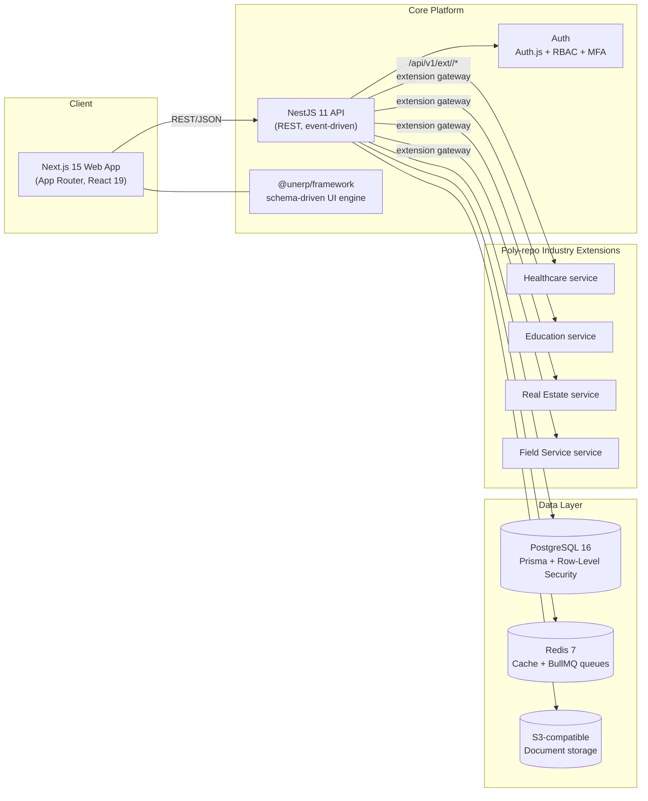

<div align="center">

# UniERP

**A composable, multi-tenant, industry-agnostic ERP system**

[](https://github.com/kannan19302/ERPSys/actions/workflows/ci.yml)
[](https://github.com/kannan19302/ERPSys/actions/workflows/codeql.yml)
[](https://github.com/kannan19302/ERPSys/actions/workflows/security-scan.yml)
[](LICENSE)
[](https://www.conventionalcommits.org)
[](CONTRIBUTING.md)

[Vision](#vision) · [Features](#features) · [Architecture](#architecture) · [Install](#installation) ·
[Dev Setup](#development-setup) · [Deployment](#deployment-guide) · [Roadmap](#roadmap) · [Contributing](#contribution-guide)

</div>

---

## Vision

Most ERPs force a choice: a rigid off-the-shelf suite that fights your business model, or a
bespoke build that takes years. **UniERP** aims for a third path — a single, composable core
(finance, HR, CRM, inventory, manufacturing, and more) that any organization can run as-is,
extend with industry-specific apps (healthcare, education, real estate, field service), and
customize without forking, via a schema-driven UI framework and a zero-code builder.

It's built AI-Agent Driven (AADD): every module follows the same binding architecture,
conventions, and quality bar, enforced by automated gates rather than tribal knowledge — so the
system stays coherent as it grows past dozens of modules and multiple poly-repo extensions.

## Features

- **33 production-ready core modules** — Finance, Advanced Finance, HR, Advanced HR, CRM, Sales,
  Inventory, Procurement, Supply Chain, Manufacturing, POS, Projects, Admin, Auth, Communication,
  Notifications, Documents, Storage, Workflow, Analytics, Reporting, API Platform, Localization,
  PWA, SaaS billing, DevOps, AI Copilot, and more — see [Modules](#modules) below.
- **True multi-tenancy** — shared database, 4-layer isolation (JWT → TenantGuard → Prisma
  middleware → PostgreSQL Row-Level Security), not just app-layer filtering.
- **RBAC everywhere** — `<module>.<resource>.<action>` permission checks on every endpoint.
- **Event-driven core** — modules communicate via domain events, never direct cross-module imports.
- **Schema-driven UI framework** (`@unerp/framework`) — DocType-style forms/lists/views generated
  from schema, so new modules don't hand-roll CRUD screens.
- **Zero-code Builder Studio** — page/form/dashboard/workflow builder plus an app marketplace for
  installing industry extensions in real time.
- **Poly-repo industry extensions** — Healthcare, Education, Real Estate, Field Service ship as
  independent repos/services behind a stable extension gateway contract.
- **Audit trail by default** — every mutation tracked via `@TrackChanges()`.
- **Full observability** — structured logs (Pino), Prometheus metrics, OpenTelemetry tracing, Sentry.

## Architecture



Full detail: [Wiki § Architecture](../../wiki/Architecture) and
[docs/ARCHITECTURE_FOUNDATION.md](docs/ARCHITECTURE_FOUNDATION.md) (binding governance).

## Technology Stack

| Layer              | Technology                                                           |
| :----------------- | :------------------------------------------------------------------- |
| **Frontend**       | Next.js 15 (App Router), React 19, TanStack Query, Zustand, Radix UI |
| **Backend**        | NestJS 11, BullMQ, Event-Driven Architecture                         |
| **Database**       | PostgreSQL 16, Prisma 6 ORM, Row-Level Security                      |
| **Cache & Queues** | Redis 7, BullMQ                                                      |
| **Auth**           | Auth.js (NextAuth v5), RBAC, Multi-Tenancy                           |
| **Testing**        | Vitest, Playwright, Supertest                                        |
| **DevOps**         | Docker, GitHub Actions, Turborepo, pnpm                              |
| **Observability**  | Pino (structured logs), Prometheus, OpenTelemetry, Sentry            |

## Screenshots

> _Placeholder — add real screenshots as the UI stabilizes. Suggested set: dashboard, a core
> module list/detail view, the Builder Studio canvas, and the mobile/PWA view._

|                                 Dashboard                                 |                                   Module Detail                                   |
| :-----------------------------------------------------------------------: | :-------------------------------------------------------------------------------: |
|  |  |

## Demo

> _Placeholder — record a short screen capture of a core workflow (e.g. create a sales order →
> generate invoice → record payment) and drop the GIF/MP4 at `docs/assets/demo.gif`._


## Modules

<details>
<summary><strong>Core Business (12)</strong></summary>

| Module               | Description                                                                       |
| :------------------- | :-------------------------------------------------------------------------------- |
| **Finance**          | Invoices, payments, GL, bank reconciliation, budgeting, multi-currency            |
| **Advanced Finance** | Chart of accounts, journal entries, fixed assets, tax engine, revenue recognition |
| **HR**               | Employees, departments, attendance, leave management                              |
| **Advanced HR**      | Payroll, shift scheduling, appraisals, benefits, tax computation                  |
| **CRM**              | Contacts, leads, opportunities, pipelines, web forms, commission tracking         |
| **Sales**            | Quotations, sales orders, delivery notes, returns, pricing rules                  |
| **Inventory**        | Products, warehouses, stock levels, costing methods (FIFO/LIFO/weighted)          |
| **Procurement**      | Vendors, purchase orders, RFQs, blanket agreements, contracts                     |
| **Supply Chain**     | Shipments, carriers, routes, demand forecasting                                   |
| **Manufacturing**    | BOM, work orders, production plans, routings, MRP                                 |
| **POS**              | Terminals, registers, shifts, cash management                                     |
| **Projects**         | Project management, timesheets, milestones, budgets, Gantt                        |

</details>

<details>
<summary><strong>Platform & Communication (15)</strong></summary>

| Module            | Description                                                |
| :---------------- | :--------------------------------------------------------- |
| **Admin**         | Tenants, users, roles, permissions, settings, audit trails |
| **Auth**          | Authentication, SSO, MFA, session management               |
| **Communication** | Messages, channels, email templates, real-time chat        |
| **Notifications** | Multi-channel delivery, preferences, digests, WebSockets   |
| **Documents**     | File storage (S3), versioning, sharing, AES-256 encryption |
| **Storage**       | S3-compatible file management                              |
| **Workflow**      | Workflow engine, approval chains, SLAs, automation rules   |
| **Analytics**     | Dashboards, reports, KPIs, widgets                         |
| **Reporting**     | Report builder, saved views, scheduled reports             |
| **API Platform**  | OpenAPI docs, webhooks, OAuth, API keys, rate limiting     |
| **Localization**  | i18n, RTL support, date/currency formats                   |
| **PWA**           | Offline mode, responsive design, push notifications        |
| **SaaS**          | Billing, metering, subscription management                 |
| **DevOps**        | CI/CD, monitoring, logging, APM                            |
| **AI**            | AI copilot, intelligent suggestions                        |

</details>

<details>
<summary><strong>Builder Studio (2)</strong></summary>

| Module          | Description                                    |
| :-------------- | :--------------------------------------------- |
| **Builder**     | Zero-code form/page/dashboard/workflow builder |
| **Marketplace** | App store for custom modules, vendor portal    |

</details>

<details>
<summary><strong>Industry Extensions — poly-repo (4)</strong></summary>

Industry apps live in **dedicated GitHub repos** and are installed/uninstalled in real time
through the marketplace — each ships a declarative bundle plus a standalone service with its
own database, reached via core's extension gateway at `/api/v1/ext/<slug>/*`
(contract: [docs/EXTENSION_SERVICE_CONTRACT.md](docs/EXTENSION_SERVICE_CONTRACT.md)).

| Module            | Repo                                                                              | Description                                        |
| :---------------- | :-------------------------------------------------------------------------------- | :------------------------------------------------- |
| **Healthcare**    | [unierp-app-healthcare](https://github.com/kannan19302/unierp-app-healthcare)     | Patient records, clinical workflows, SMART/FHIR    |
| **Education**     | [unierp-app-education](https://github.com/kannan19302/unierp-app-education)       | Student management, courses, grading, LMS          |
| **Real Estate**   | [unierp-app-realestate](https://github.com/kannan19302/unierp-app-realestate)     | Property management, lease accounting              |
| **Field Service** | [unierp-app-fieldservice](https://github.com/kannan19302/unierp-app-fieldservice) | Dispatch, work orders, mobile technician workflows |

</details>

## Installation

### Prerequisites

- Node.js ≥ 22
- pnpm ≥ 9 (`corepack enable`)
- Docker (for PostgreSQL, Redis, MinIO)

### Quick start

```bash
git clone https://github.com/kannan19302/ERPSys.git
cd ERPSys
pnpm install
cp .env.example .env.local   # fill in secrets — see Environment Variables below

# Containerized (recommended) — builds, starts Postgres/Redis/MinIO,
# runs migrations, and seeds mock data in one step.
.\scripts\docker-start.ps1
```

Once started:

| Service       | URL                           |
| :------------ | :---------------------------- |
| Web App       | http://localhost:3000         |
| API Backend   | http://localhost:3001/api/v1  |
| Swagger Docs  | http://localhost:3001/swagger |
| MinIO Console | http://localhost:9001         |

### Manual / Docker-only setup

```bash
docker compose -f docker-compose.dev.yml up -d --build
```

## Development Setup

```bash
pnpm dev            # all apps
pnpm dev:web        # web only
pnpm dev:api        # api only
```

| Script                                                | Description                                             |
| :---------------------------------------------------- | :------------------------------------------------------ |
| `pnpm dev`                                            | Start all apps in development mode                      |
| `pnpm dev:web` / `pnpm dev:api`                       | Start a single app                                      |
| `pnpm docker:up` / `pnpm docker:down`                 | Start/stop the full Docker stack                        |
| `pnpm build`                                          | Build all packages and apps                             |
| `pnpm test` / `pnpm test:coverage` / `pnpm test:e2e`  | Unit / coverage / Playwright E2E                        |
| `pnpm lint` / `pnpm format`                           | ESLint / Prettier across the workspace                  |
| `pnpm typecheck`                                      | TypeScript project references                           |
| `pnpm architecture:check`                             | Required before any API change                          |
| `pnpm migration:discipline`                           | Required before any database change                     |
| `pnpm db:migrate` / `pnpm db:studio` / `pnpm db:seed` | Database workflows (`db:push` is disabled by design)    |
| `pnpm changeset`                                      | Record a changeset for a package that will be versioned |

Pre-commit runs lint-staged (ESLint + Prettier on changed files); commit messages are enforced
as [Conventional Commits](https://www.conventionalcommits.org) via commitlint.

## Folder Structure

```
ERPSys/
├── apps/
│   ├── api/                 # NestJS backend (port 3001)
│   └── web/                 # Next.js 15 frontend (port 3000)
├── packages/
│   ├── database/            # Prisma schema, migrations, RLS
│   ├── shared/               # Types, Zod validators, constants
│   ├── auth/                 # Auth.js + RBAC guards
│   ├── framework/             # Schema-driven UI framework
│   ├── service-kit/           # Poly-repo extension contract
│   ├── ui/, ui-tokens/, ui-*  # Design system (Radix + CSS tokens, data grid, charts, forms...)
│   └── config/                # Shared ESLint, TypeScript, Prettier configs
├── docs/                     # Architecture, security, runbooks, policies
├── .ai/                      # AI-agent reference docs (module registry, autopilot protocol)
├── scripts/                  # Dev tooling (startup, gates, workspace-link repair)
├── load-tests/                # k6 load test scenarios
├── .github/                  # Workflows, issue/PR templates, CODEOWNERS, labeler
├── AGENTS.md                 # AI agent master instructions
└── RUNBOOK.md                 # Operations runbook
```

## Environment Variables

Full list in [`.env.example`](.env.example). Key variables:

| Variable                      | Required | Description                            |
| :---------------------------- | :------- | :------------------------------------- |
| `DATABASE_URL`                | Yes      | PostgreSQL connection string           |
| `REDIS_URL`                   | Yes      | Redis connection string                |
| `NEXTAUTH_SECRET`             | Yes      | Auth.js secret (32+ random bytes)      |
| `NEXTAUTH_URL`                | Yes      | Frontend URL (`http://localhost:3000`) |
| `PII_ENCRYPTION_KEY`          | Yes      | 32-byte hex key for PII encryption     |
| `API_URL`                     | Yes      | Backend URL (`http://localhost:3001`)  |
| `SENTRY_DSN`                  | No       | Sentry error tracking                  |
| `OTEL_EXPORTER_OTLP_ENDPOINT` | No       | OpenTelemetry collector                |

## Deployment Guide

```bash
docker compose -f deploy/docker-compose.prod.yml up -d --build
pnpm --filter @unerp/database exec prisma migrate deploy
```

See [RUNBOOK.md](RUNBOOK.md) for the full operational reference (health checks, observability,
incident response) and [docs/RUNBOOK_BACKUP_RESTORE.md](docs/RUNBOOK_BACKUP_RESTORE.md) for
backup/restore procedures.

| Service       | Port | Health Check                                              |
| :------------ | :--- | :-------------------------------------------------------- |
| API (NestJS)  | 3001 | `GET /health` (liveness), `GET /api/v1/ready` (readiness) |
| Web (Next.js) | 3000 | `GET /`                                                   |
| PostgreSQL    | 5432 | `pg_isready`                                              |
| Redis         | 6379 | `redis-cli ping`                                          |

### API Documentation

Swagger UI is served at `/swagger` when the API is running. Endpoint format:
`/api/v1/<module>/<resource>`. Response envelope:

```json
{ "statusCode": 200, "data": {}, "meta": { "page": 1, "total": 100 } }
```

## Quality & Production Readiness

- **Scorecard**: 10/10 heuristic across all 33 modules (7-dimension rubric: functionality,
  validation, tests, security, observability, docs, ops) — verified against real compile/test
  runs, not taken at face value.
- **TypeScript**: strict mode with `noUncheckedIndexedAccess`.
- **Test coverage**: 80%+ target (Vitest unit, Supertest integration, Playwright E2E); see the
  `coverage` job in [CI](.github/workflows/ci.yml).
- **Security**: RBAC on every route, tenant isolation via RLS, AES-256 encryption for PII, audit
  logging, CodeQL, Dependabot, secret scanning — see [SECURITY.md](SECURITY.md).
- **Code quality**: ESLint 9 (flat config), Prettier, Husky pre-commit + commit-msg hooks,
  lint-staged, commitlint.

## Roadmap

Tracked live in [.ai/MODULE_REGISTRY.md](.ai/MODULE_REGISTRY.md) (per-module status) and
[.ai/FOUNDATION_HARDENING_ROADMAP.md](.ai/FOUNDATION_HARDENING_ROADMAP.md) (foundation gates).
At a glance:

- [x] Core platform: 33 modules at production-ready baseline
- [x] Multi-tenant RLS, RBAC, event-driven architecture
- [x] Poly-repo industry extension contract (Healthcare, Education, Real Estate, Field Service)
- [x] Builder Studio (zero-code forms/pages/dashboards/workflows) + Marketplace
- [ ] Foundation hardening seal (see roadmap doc — tracks 0/A–I)
- [ ] Public API/webhook GA + partner developer portal
- [ ] Deeper module strengthening (500+ features per module, core → industry order)

See open [Issues](../../issues) and [Milestones](../../milestones) for granular, in-flight work.

## Contribution Guide

See [CONTRIBUTING.md](CONTRIBUTING.md) for branching, commit conventions, local verification
steps, and the PR checklist. Please also read [AGENTS.md](AGENTS.md) and
[docs/ARCHITECTURE_FOUNDATION.md](docs/ARCHITECTURE_FOUNDATION.md) before proposing changes —
they're binding, not optional. This project follows a [Code of Conduct](CODE_OF_CONDUCT.md).

## AI-Agent Development

This project is built with AI-Agent Driven Development (AADD). All AI agents must follow:

- [AGENTS.md](AGENTS.md) — master instruction set
- [.ai/](.ai) — architecture, conventions, module registry, security, API standards, data model,
  testing docs

## License

Proprietary — All rights reserved. See [LICENSE](LICENSE).

## Contact

- **Issues**: [github.com/kannan19302/ERPSys/issues](https://github.com/kannan19302/ERPSys/issues)
- **Discussions**: [github.com/kannan19302/ERPSys/discussions](https://github.com/kannan19302/ERPSys/discussions)
- **Security**: see [SECURITY.md](SECURITY.md) — report privately via Security Advisories
- **Maintainer**: [@kannan19302](https://github.com/kannan19302)
